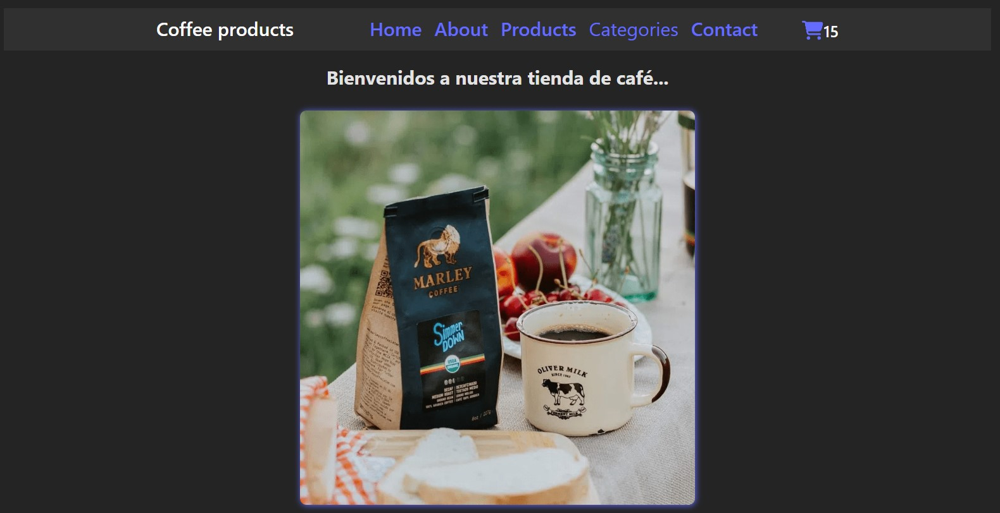
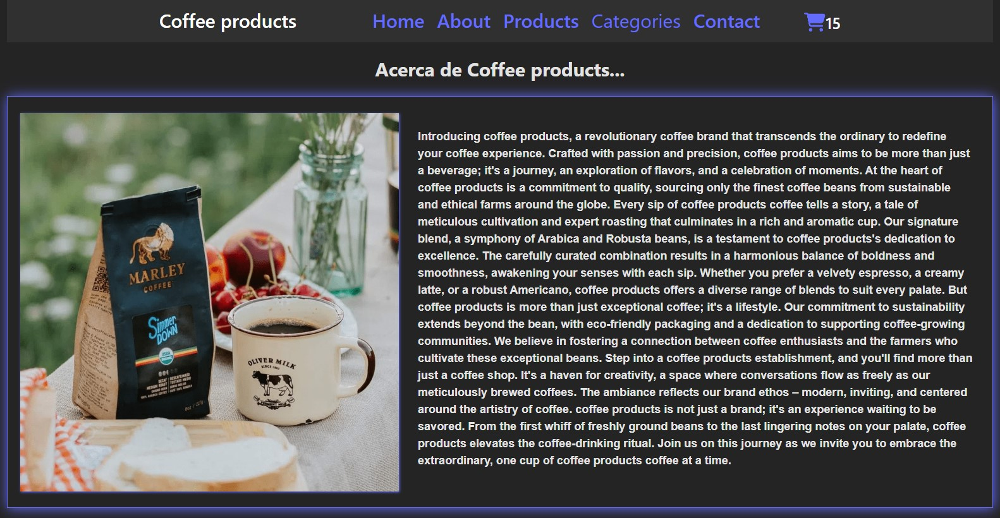
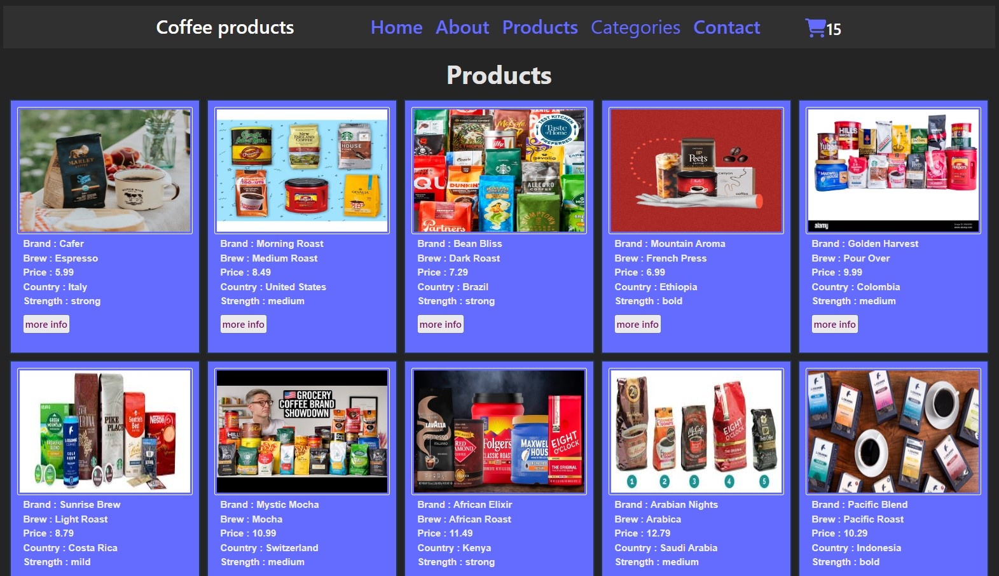
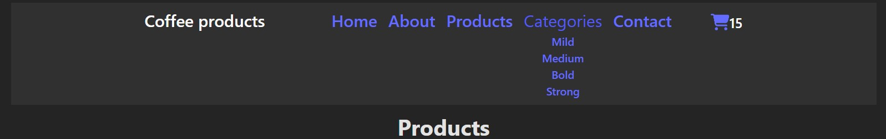
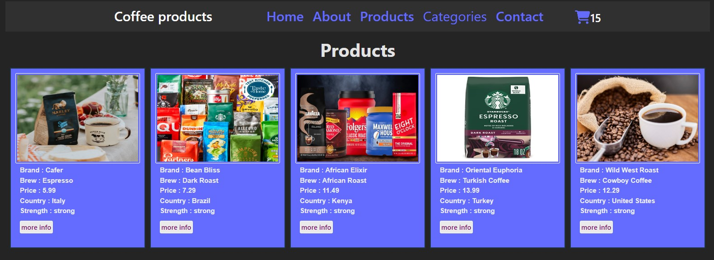
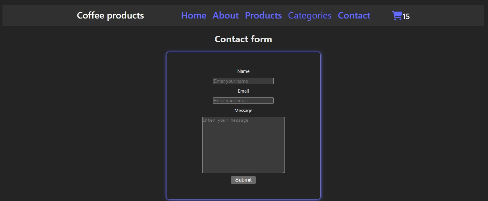

# E-commerce web
## Funcionalidad de la web.

## Libraries
en este proyecto se usaron las las siguientes librerías:

1. react bootstrap
2. react-router-dom
3. fortawesome/react-fontawesome
4. firebase

## Acerca del proyecto

el proyecto e-commerce se basa en tener una tienda online para la venta de productos(en este caso café), donde puedes filtrar productos por categorias. Puedes agregar tus productos a un carrito de compras y/o borrarlos.
Aplicamos el CRUD.

## Web images

### home

### about

### products

### categories

### filtered categories

### contact

